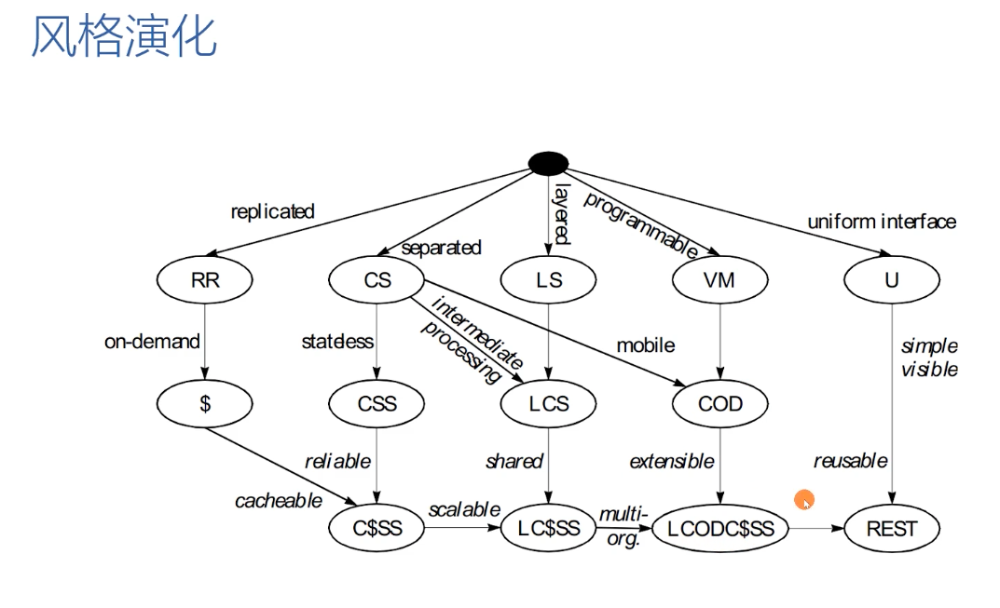

### 加密相关概念

#### （encryption）加密
加密成为不可读的新格式。

#### （decryption）解密
解密回原有格式。

#### （plaintext）明文
未加密的原文件。

#### （ciphertext）密文
加密后的文件。

#### （attacker）攻击者
企图对密文进行解密的人。

#### （transposition）换位
换位法：相同的数据，不同的顺序。

#### （Kerckhoffs‘ principle）柯克霍夫原则
数据的安全不应该依赖于加密方法本身来保证加密。

#### （brute force）暴力攻击
尝试所有可能性以找出密文所使用的加密方法。

#### （substitution）替换法
会系统地替换各个独立的数据块。例如以文本信息为例，把信息中的每一个字母替换成另一个字母。把每个A替换成D，把每个B替换成H，以此类推。

#### (frequency analysis) 频率分析
根据日常中字母的使用频率结合密文中字母的使用频率，推导出字母替换的规则。

#### （polyalphabetic substitution）多表替换
加密时变化替换模式。比如，明文中第一个E可能被替换成A，但明文中的第二个E却被替换成T。

#### （Advanced Encryption Standard，AES）高级加密标准
0.明文数据切分
AES在处理初期会把明文数据切分成16个字节的小块并放入4x4的格子中。
1.替换
使用与秘钥扩展处理流程中用到的同样的S-box表，对格子中16个字节的每一个都进行替换处理。
2.行换位
然后，将格子中的行内字节移动到不同位置。
3.列组合
针对格子中的每个字节，将其所在列的全部4个字节组合起来，并计算出一个新的字节。该计算需要再次用到异或运算，以及二进制形式的换位。
4.使用秘钥进行异或运算
最后，再将前面几步的计算结果，与该轮处理对应的那个秘钥进行异或运算。

#### （block chaining）数据块链接
当使用数据块链接时，明文中的首个数据块，会在加密前与一个随机的128位数进行异或运算。这个随机数被称为初始变量（starting variable），并与密文一起存储。

#### （diffusion）扩散
密文格中任一字节的最终值都取决于明文数据格式中的所有字节的初始值。这种加密特性也被成称为扩散。

#### （avalanche）雪崩效应
明文的任何细微变化，都会导致整个密文产生巨大的变化。

#### （timing attack）时序攻击
指攻击者通过搜集数据加密处理占用时长的相关信息的一种攻击方式。

#### （shared key problem）秘钥共享问题
秘钥传输的问题


# 网络安全：HTTPS

网页传输使用的是HTTP，即超文本传输协议（Hypertext Transfer Protocol）。
当网页数据以安全的方式传输时，使用的是HTTPS，这里的S代表的就是安全（secure）。
这就是为什么当你传输加密数据时，你将会在你的浏览器的地址栏起始位置看到 https 的字样。
大多数人认为网络安全是理所当然的事情，但是你要知道，能够在两个刚刚建立联系的双方之间，就立刻建立信任和安全，其实是一项很了不起的功能，这需要用到目前为止，你所了解到的所有技巧和技术。

握手（handshaking）：
1. 第一步
客户端告诉服务器其所支持的加密方法。HTTPS协议允许计算机从一系列可接受的加密算法中进行选择，这意味着你所访问的采用了不同安全策略的网站，可能使用不同的加密技术来提供或高或低的安全强度。除了加密支持信息以外，客户端还需要提供一个随机数，其目的你很开会看到。
2. 第二步
服务器带着支持的加密方法列表以及证书（certificate）进行回应。服务器证书包含多份数据，其中有网站的域名（例如 amazon.com）、证书发行人（certificateissuer，核对网站身份的机构）的名字，以及服务器的公钥。HTTP可以使用多种不同的公钥加密系统，不过RSA最常用。服务器为每个所处理的客户端都使用相同的证书，所以对于每个证书来说，公钥私钥对只会创建一次。虽然这意味着服务器对所有客户端使用的都是同样的RSA秘钥，不过，RSA秘钥只会在握手阶段使用。
在服务端证书还包含一个签名（signature），数字签名就是散列码。在本例中，服务器将证书数据进行散列，然后使用服务器私钥对生成的散列码进行加密。
另外，服务器也会给客户端发送一个随机数，就像客户端会向服务端发送一个随机数一样。
3. 第三步
客户端验证证书，该验证流程分两个部分。首先，客户端将服务端的公钥作用于证书的散列码，然后再散列证书本身，最后比较这两个散列码。如果散列码匹配，就说明证书是有效的，不过这不能证明这个是网站真正使用的证书。
接下来客户端必须委托你的浏览器中内嵌的证书机构，来验证证书的发行人。如果你深入你的浏览器选项中，你将会在一个例如“受信任根证书颁发机构（Trusted root certification authorities）”的标题下，找到一个发行人列表。发行人会提供一个网站证书的副本，当该副本与服务器提供的证书相匹配时，客户端就可以确认服务器的身份。
4. 第四步
客户端随机生成另一个随机数，48字节长，或者说是384位，被称为预主密钥（premaster secret）。正如其名称所表示的那样，该数字必须保密。但是，由于客户端需要把它发送给服务器，因此客户端就使用服务器提供的公钥来将其加密。
5. 第五步
客户端和服务端各自对预主密钥和最开始那两步交换的那两个随机数的组合进行散列，并以此来创建出长度为384位的主密钥（master secret）。一旦主密钥创建好，就丢弃预祝秘密和那两个随机数。


#### 主密钥 组成
主密钥 384位，分成3段 128位的数据段。
第一段：用于数据加密
主密钥的第一段作为像AES这种加密系统的秘钥。在整个安全会话期间，会使用该秘钥对每个后续传输的数据进行加密。

第二段：数据块链接
当使用数据块链接时，明文中的首个数据块，会在加密前与一个随机的128位数进行异或运算。这个随机数被称为初始变量（starting variable），并与密文一起存储。

第三段：消息认证码
主密钥最后的128位数据段，被用来为每次传输的数据创建一个消息认证码（message authentication code，MAC）。在HTTPS的传输中，我们不必再去认证发送者的身份，因为在握手阶段已经认证过了。相反，我们使用MAC来确认数据在传输过程中没有被修改。
在这个过程中，每次传输的数据都会通过一个像MD5这样的函数来进行散列，但是在散列前，传输的数据会先主密钥最后的那128位数据段进行组合。这就是所谓的秘钥散列（keyed hashing），而这种情况下的这个128位数据段被称为MAC秘钥。通过使用秘钥散列可以有助于避免中间人攻击。攻击者若想要传输假冒数据给接收者，就需要使用MAC秘钥来生成一个可被接收者真正接受的散列码。
由于散列码发生在加密之前，所以原始信息和散列码都会被加密。


# Web 协议
###### [ABNF 语法](https://www.ietf.org/rfc/rfc5234.txt)
###### 工具
```
// 安装 telnet
brew install telnet
```

###### 评估 Web 架构的七大关键属性
- 性能 Performance：影响高可用的关键因素。
  - 网络性能 Network Performance
    - Throughput 吞吐量：小于等于带宽 bandwidth；
    - Overhead 开销：首次开销，每次开销；
  - 用户感知到的性能 User-perceived Performance
    - Latency 延迟：发起请求到接收到响应的时间；
    - Completion 完成时间：完成一个应用动作所花费的时间；
  - 网络效率 Network Efficiency
    - 重用缓存、减少交互次数、数据传输距离更近、COD；
- 可伸缩性 Scalability：支持部署可以互相交互的大量组件。
- 简单性 Simplicity：易理解、易实现、易验证。
- 可见性 Visiable：对两个组件的交互进行监视或者仲裁的能力。如缓存、分层设计等。
- 可移植性 Portability：在不同的环境下运行的能力。
- 可靠性 Reliability：出现部分故障时，对整体影响的程度。
- 可修改性 Modifiability：对系统作出修改的难易程度，由可进化性、可定制性、可扩展性、可配置性、可重用性构成。
  - 可进化性 Evolvability：一个组件独立升级而不影响其他组件；
  - 可扩展性 Extensibility：向系统添加功能，而不影响到系统的其他部分；
  - 可定制性 Customizability：临时性、定制性地更改某一要素来提供服务，不对常规客户产生影响；
  - 可配置性 Configurability：应用部署后可通过修改配置提供新的功能；
  - 可重用性 Reusability：组件可以不作修改在其他应用中使用；

###### 5种架构风格
- 数据流风格 Data-flow Stles
  - 优点：简单性、可进化性、可扩展性、可配置性、可重用性；
  - 管道与过滤器 Pipe And Filter，PF
    - 每个Filter 都有输入端和输出端，只能从输入端读取数据，处理后再从输出端产生数据；
  - 统一接口的管道与过滤器 Uniform Pipe And Filter，UPF
    - 在 PF 基础上增加了统一接口的约束，所有 Filter 过滤器必须具备相同的接口 Interface；
- 复制风格 Replication Styles
  - 优点：用户可察觉的性能、可伸缩性、网络效率、可靠性；
  - 复制仓库 Replicated Repository，RR
    - 多个进程提供相同的服务，通过反向代理对外提供集中服务；
  - 缓存 $
    - RR的变体，通过复制请求的结果，为后续请求复用；
- 分层风格 Hierarchical Styles
  - 优点：简单性、可进化性、可伸缩性；
  - 客户端服务器 Client-Server，CS
    - 由 Client 触发请求，Server 监听请求后产生响应，Client 一直等待接收响应后，会话结束；
    - 分离关注点，隐藏细节。
  - 分层系统 Layered System，LS
    - 每一层为其之上的层服务，并使用在其之下的层所提供的服务，例如 TCP/IP；
  - 分层客户端服务端 Layered Client-Server，LCS
    - LS + CS，例如正向代理和反向代理，从空间上分为外部层与内部层；
  - 无状态、客户端服务器 Client-Stateless-Server，CSS
    - 基于 CS，服务器上不允许有 session state 会话状态；
    - 提升了可见性、可伸缩性、可靠性，但重复数据导致降低网络性能；
  - 缓存、无状态、客户端服务端 Client-Cache-Stateless-Server，C$SS
    - 提升性能
  - 分层、缓存、无状态、客户端服务端 Layered-Client-Cache-Stateless-Server，LC$SS
    - 总和！
- 移动代码风格 Mobile Code Styles
  - 优点：可移植性、可扩展性、网络效率；
  - 虚拟机 Virtual Machine，VM
    - 分离指令与实现；
  - 远程求值 Remote Evaluation，REV
    - 基于 CS 的VM，将代码发送至服务器执行；
  - 按需代码 Code on Demand，COD
    - 服务器在响应中返回处理代码，在客户端执行；（JavaScript、CSS）
    - 优秀的可扩展性和可配置性，提升用户可察觉性能和网络效率；
  - 分层、按需代码、缓存、无状态、客户端服务器 Layered-Code-on-Demand-Client-Cache-Stateless-Server，LCODC$SS
    - LC$SS + COD
  - 移动代理 Mobile Agent，MA
    - 相当于 REV + COD
- 点对点风格 Peer-toPeer Styles
  - 优点：可进化性、可重用性、可扩展性、可配置性；
  - Event-based Integration，EBI
    - 基于事件集成系统，如由 Kafka 这样的消息系统 + 分发订阅来消除耦合；
    - 优秀的可重用性、可扩展性、可进化性；
    - 缺乏可理解性；
    - 由于消息广播等因素造成的消息风暴，可伸缩性差；
  - [Chiron-2，C2](https://users.soe.ucsc.edu/~ejw/papers/c2-icse17.pdf)
    - 相当于 EBI + LCS，控制了消息的方向
  - Distributed Objects，DO
    - 强调组件结对交互；
  - Brokered Distributed Objects，BDO
    - 引入名字解析组件来简化 DO，例如：CORBA；


